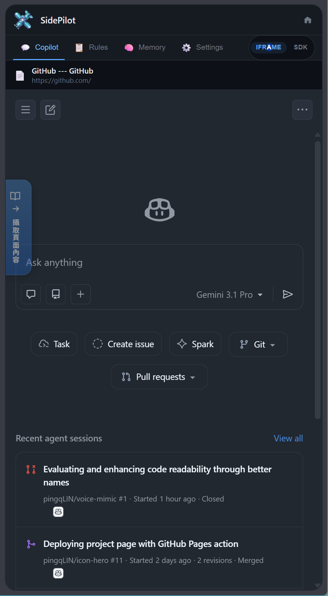
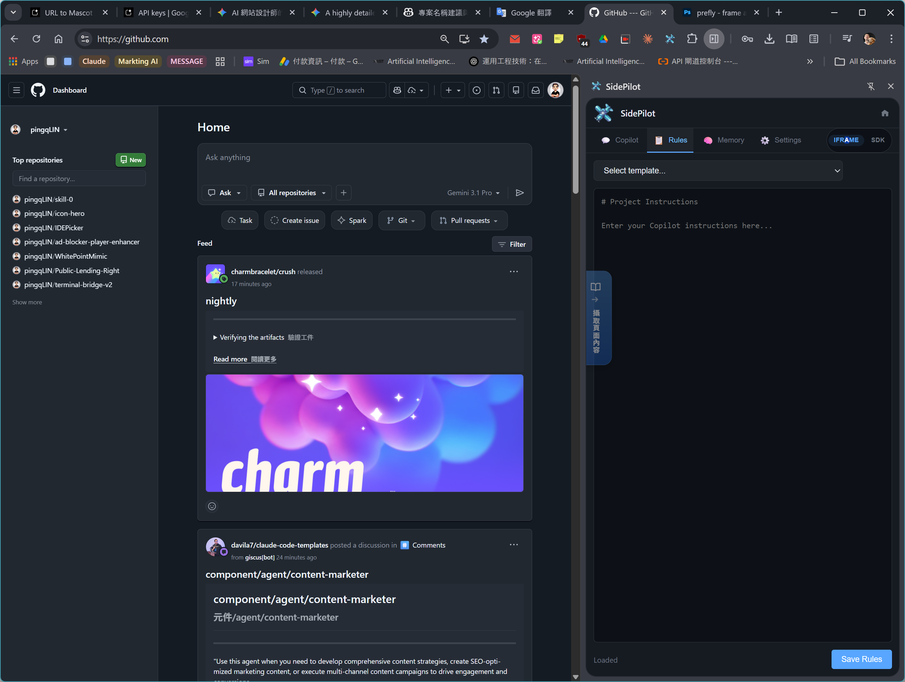
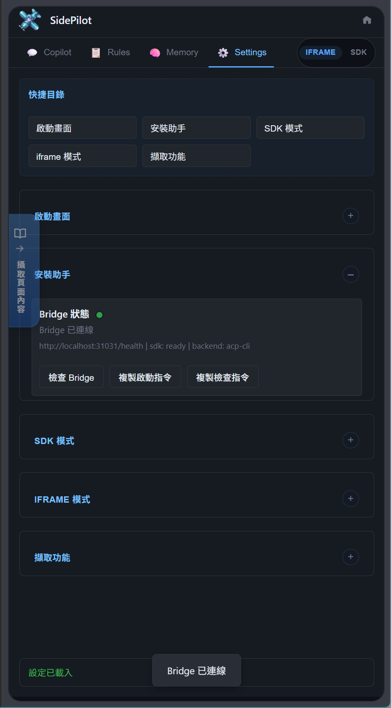
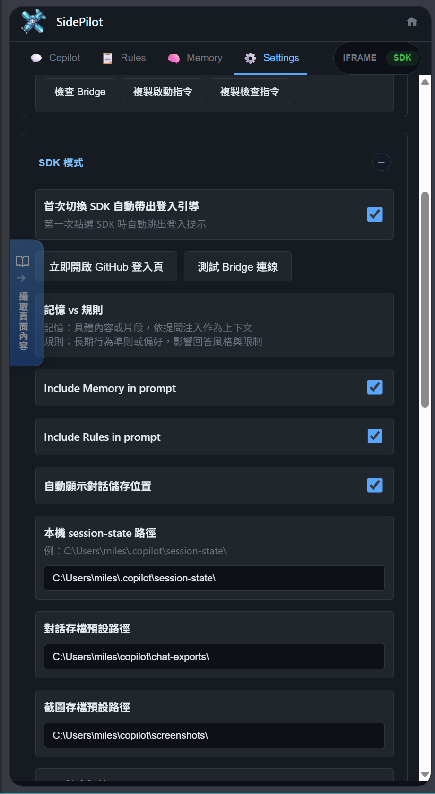
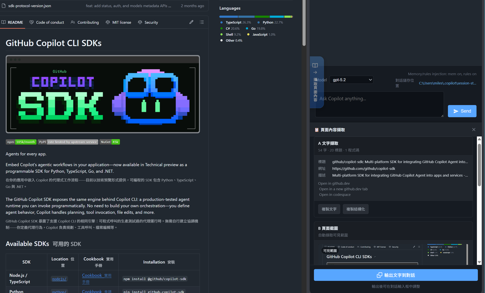
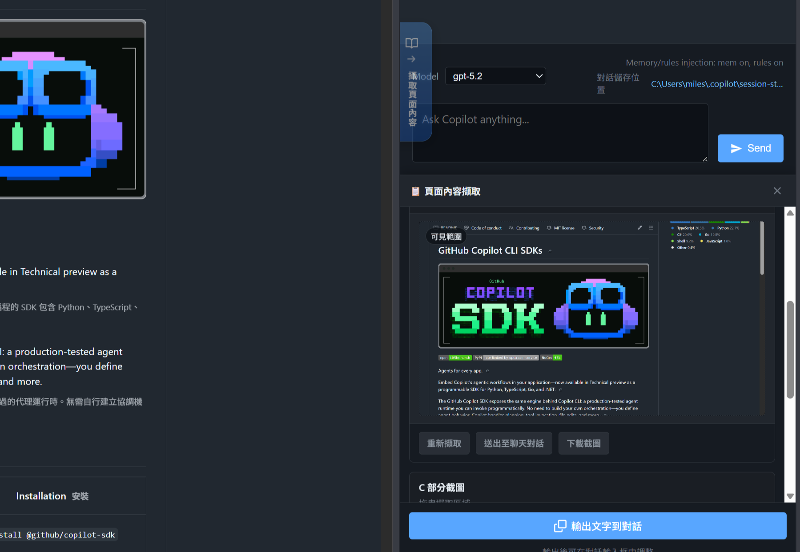
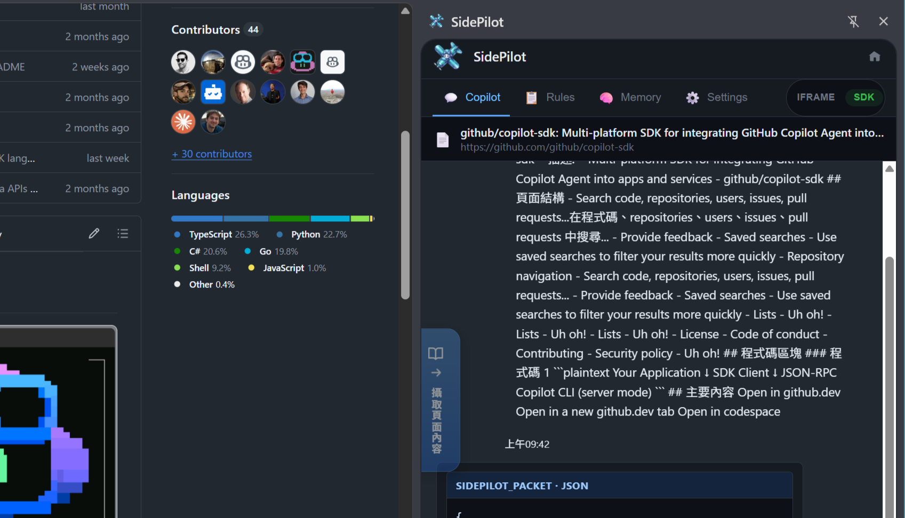

<p align="center">
  
</p>

<h1 align="center">SidePilot</h1>

<p align="center">
  
  
  
  
  
</p>

<p align="center">
  <b>GitHub Copilot, always at your side — persistent AI chat in the browser side panel.</b>
</p>

<p align="center">
  <a href="#-screenshots">Screenshots</a> &bull;
  <a href="#-features">Features</a> &bull;
  <a href="#-quick-start">Quick Start</a> &bull;
  <a href="#-usage-guide">Usage Guide</a> &bull;
  <a href="#%EF%B8%8F-configuration">Configuration</a> &bull;
  <a href="#-api-reference">API Reference</a> &bull;
  <a href="#-security">Security</a> &bull;
  <a href="#-faq">FAQ</a>
</p>

<p align="center">
  <a href="README.zh-TW.md">繁體中文</a>
</p>

---

## ✨ Screenshots

<table>
  <tr>
    <td align="center"><b>iframe Mode</b><br></td>
    <td align="center"><b>SDK Mode</b><br></td>
  </tr>
</table>

<details>
<summary><b>More screenshots</b></summary>
<br>

| Feature | Screenshot |
|---------|-----------|
| **Rules Tab** — Manage behavioral instructions alongside GitHub |  |
| **Settings Panel** — Collapsible sections for all configuration |  |
| **SDK Settings** — Memory/rules injection, storage paths |  |
| **Page Capture (Text)** — Extract page content to chat |  |
| **Page Capture (Screenshot)** — Partial screenshot extraction |  |
| **SDK + Context** — Captured page context in SDK mode |  |

</details>

---

## ✨ Features

- **Dual Mode Architecture** — iframe mode for web Copilot, SDK mode for official Copilot CLI bridge
- **Memory Bank** — Store tasks, notes, context, and references with status tracking and search
- **Rules Management** — Define behavioral instructions with built-in templates (Default, TypeScript, React)
- **Page Capture** — Extract page text, take full or partial screenshots with a vertical floating button
- **Link Guard** — Allowlist or denylist control over iframe link navigation
- **Config Sync** — Sync model, theme, reasoning effort to `~/.copilot/config.json`
- **Context Injection** — Auto-inject memory entries and rules before prompts (SDK mode)
- **Streaming Responses** — Real-time SSE streaming in SDK mode with tool execution support

---

## 🚀 Quick Start

### 1. Install the Extension

1. Open `chrome://extensions/` in Chrome
2. Enable **Developer mode** (top-right toggle)
3. Click **Load unpacked**
4. Select the `SidePilot/extension` folder

### 2. Open the Side Panel

| Platform | Shortcut |
|----------|----------|
| Windows / Linux | `Alt + Shift + P` |
| macOS | `Opt + Shift + P` |

Or click the SidePilot extension icon in the toolbar.

### 3. Choose Your Mode

| Mode | Setup | Best For |
|------|-------|----------|
| **iframe** | Zero config — works immediately | Quick access to Copilot web UI |
| **SDK** | Requires bridge server (see below) | Official API, streaming, context injection |

<details>
<summary><b>SDK Mode Setup (Bridge Server)</b></summary>

#### Prerequisites

- **Node.js 18+** installed
- **GitHub Copilot CLI** installed and authenticated

```bash
# Verify Copilot CLI is available
copilot --version
```

#### Start the Bridge Server

```bash
cd scripts/copilot-bridge
npm install
npm run dev          # Development mode with hot-reload
```

For production:

```bash
npm run build
npm start            # Starts with Supervisor (auto-restart)
```

The bridge runs on `http://localhost:31031`. Switch to **SDK** mode in the side panel and start chatting.

#### First-Time GitHub Login

1. Switch to SDK mode in the side panel
2. A login guide appears automatically
3. Click **Open GitHub Login Page** to authenticate
4. After authentication, click **Test Bridge Connection** to verify

</details>

---

## 📖 Usage Guide

> For a detailed walkthrough of every feature, see **[docs/USAGE.md](docs/USAGE.md)**.

<details>
<summary><b>iframe Mode</b></summary>

#### How It Works

iframe mode embeds the GitHub Copilot web interface directly in the side panel. No server required.

#### Using Copilot Chat

1. Open the side panel and ensure **IFRAME** mode is selected
2. The Copilot web UI loads inside the panel
3. Chat, use agents (Task, Create Issue, Spark), and browse sessions as normal
4. A floating **capture button** on the left edge lets you grab page content

#### Link Guard

Links clicked inside the iframe are controlled by the Link Guard:

- **Allowlist mode** (default) — Only URLs matching the allowlist stay in the iframe; others open in a new tab
- **Denylist mode** — URLs matching the denylist open in a new tab; all others stay

Configure patterns in **Settings > iframe Mode**.

> **Note:** iframe mode removes `X-Frame-Options` and CSP headers via Chrome's Declarative Net Request API to enable embedding.

</details>

<details>
<summary><b>SDK Mode</b></summary>

#### How It Works

SDK mode connects to GitHub Copilot through the official `@github/copilot-sdk` via a local bridge server.

```
Extension ←→ HTTP/SSE ←→ Bridge Server ←→ Copilot CLI (ACP)
```

#### Chatting

1. Ensure the bridge server is running (`npm run dev`)
2. Switch to **SDK** mode in the side panel
3. Select a model from the dropdown (e.g., `gpt-5.2`)
4. Type your message and click **Send** or press Enter
5. Responses stream in real-time via Server-Sent Events

#### Context Injection

When enabled in Settings, SidePilot automatically prepends:

- **Memory entries** — Up to 5 most relevant entries (max 3,600 chars)
- **Rules** — Your active behavioral instructions (max 2,200 chars)

This gives Copilot persistent context about your project without repeating yourself.

#### Session Management

- Each conversation is a separate Copilot CLI session
- Sessions are created on first message
- Chat exports are saved to the configured path (default: `~/copilot/chat-exports/`)

</details>

<details>
<summary><b>Memory Bank</b></summary>

#### Overview

The Memory Bank stores structured entries that persist across sessions. Four entry types:

| Type | Icon | Weight | Purpose |
|------|------|--------|---------|
| Task | `[T]` | 1 | Trackable work items with status |
| Note | `[N]` | 2 | Quick thoughts and observations |
| Context | `[C]` | 4 | Project context and environment info |
| Reference | `[R]` | 3 | Links, docs, and external resources |

#### Creating Entries

1. Go to the **Memory** tab
2. Click **Add Entry**
3. Select a type, enter content, set status (Pending / In Progress / Done)
4. Click **Save**

#### Search & Filter

- Use the search bar for full-text search across all entries
- Filter by type (Task, Note, Context, Reference) or status
- Entries are sorted by weight, then by creation date

#### VS Code Integration

Click the VS Code icon on any entry to send it to VS Code via a custom URI scheme (`vscode://` / `cursor://`).

</details>

<details>
<summary><b>Rules Management</b></summary>

#### Overview

Rules are long-form behavioral instructions sent to Copilot to shape its responses (SDK mode only).

#### Built-in Templates

| Template | Description |
|----------|-------------|
| Default | General-purpose coding assistant instructions |
| TypeScript | TypeScript-specific conventions and best practices |
| React | React component patterns and hooks guidelines |

#### Writing Rules

1. Go to the **Rules** tab
2. Select a template or start from scratch
3. Write instructions in markdown format
4. Click **Save Rules** (max 2,200 characters)

#### Import / Export

- **Export** — Download rules as a `.md` file
- **Import** — Load rules from a markdown file

</details>

<details>
<summary><b>Page Capture</b></summary>

#### Floating Capture Button

A vertical button appears on the left edge of every page. It provides:

| Action | Description |
|--------|-------------|
| **Text Content** | Extracts full page text with structure preserved |
| **Code Blocks** | Detects and extracts markdown code blocks from the page |
| **Full Screenshot** | Captures the visible viewport |
| **Partial Screenshot** | Select a region to capture |

#### How to Use

1. Click the floating **capture button** (left edge of page)
2. Choose a capture type from the popup
3. Captured content appears in the side panel
4. Drag or paste content into the chat input

#### Adjusting Button Size

Go to **Settings > Capture** and adjust the button width (1–128 px).

</details>

---

## ⚙️ Configuration

All settings are accessible from the **Settings** tab in the side panel. Sections are collapsible for easy navigation.

<details>
<summary><b>Complete Configuration Reference</b></summary>

### Intro & Welcome

| Setting | Type | Description |
|---------|------|-------------|
| Play Every Open | Toggle | Replay intro animation each session |
| Show Warning | Toggle | Display risk disclaimer on startup |

### Bridge Setup (SDK)

| Setting | Type | Description |
|---------|------|-------------|
| Health Check | Button | Test bridge server connectivity |
| Copy Start Command | Button | Copy `npm run dev` command |
| Copy Health Check | Button | Copy `curl localhost:31031/health` |

### SDK Mode

| Setting | Type | Description |
|---------|------|-------------|
| First-Time Login Guide | Toggle | Show login guide on first SDK switch |
| Include Memory in Prompt | Toggle | Auto-inject memory entries before messages |
| Include Rules in Prompt | Toggle | Auto-inject rules before messages |
| Show Storage Location | Toggle | Display chat save path in UI |
| Session-state Path | Text | Local `.copilot/session-state/` directory |
| Chat Export Path | Text | Directory for conversation exports |
| Screenshot Path | Text | Directory for saved screenshots |

### Copilot CLI Sync

| Setting | Type | Options | Description |
|---------|------|---------|-------------|
| Sync Model | Toggle | — | Sync selected model to CLI config |
| Sync Theme | Toggle | auto / dark / light | Sync color theme preference |
| Sync Banner | Toggle | always / once / never | Sync banner display frequency |
| Sync Reasoning Effort | Toggle | low / medium / high | Sync reasoning level |

### iframe Mode

| Setting | Type | Description |
|---------|------|-------------|
| Link Guard Mode | Select | `allow` (whitelist) or `deny` (blacklist) |
| URL Patterns | Textarea | One URL prefix per line |

### Capture

| Setting | Type | Range | Description |
|---------|------|-------|-------------|
| Button Width | Slider | 1–128 px | Floating capture button width |

</details>

---

## 🔌 API Reference

The bridge server exposes a REST + SSE API on `http://localhost:31031`.

<details>
<summary><b>Bridge Server Endpoints</b></summary>

### Health Check

```bash
GET /health
```

```json
{
  "status": "ok",
  "service": "copilot-bridge",
  "sdk": "ready",
  "backend": "acp-cli"
}
```

### Models

```bash
GET /api/models
```

Returns available AI models for the current Copilot subscription.

### Sessions

```bash
POST /api/sessions          # Create a new chat session
GET  /api/sessions          # List active sessions
DELETE /api/sessions/:id    # Terminate a session
```

### Chat (Streaming)

```bash
POST /api/chat
Content-Type: application/json

{
  "sessionId": "abc-123",
  "message": "Explain this code"
}
```

Returns a Server-Sent Events stream:

| Event | Payload | Description |
|-------|---------|-------------|
| `delta` | `{ content }` | Text chunk update |
| `tool` | `{ name, status }` | Tool execution progress |
| `message` | `{ content }` | Complete response |
| `error` | `{ message }` | Error details |
| `done` | `{}` | Stream termination |

### Chat (Synchronous)

```bash
POST /api/chat/sync
Content-Type: application/json

{
  "sessionId": "abc-123",
  "message": "Explain this code"
}
```

Returns `{ success: true, content: "..." }` after the full response completes.

</details>

---

## 🔒 Security

> This section is especially relevant when **self-hosting or iteratively developing** SidePilot. Review each topic before exposing the bridge server beyond your local machine.

<details>
<summary><b>Development Security Checklist</b></summary>

Before running the bridge server in any shared or CI environment, confirm the following:

- [ ] Bridge server is bound to `127.0.0.1` (loopback) — do not remove the hostname from `app.listen()` in shared environments
- [ ] Port `31031` is not reachable from outside your machine (firewall / VPN)
- [ ] No GitHub tokens or credentials are committed to source control
- [ ] `COPILOT_CONFIG_PATH` environment variable (if set) points to a non-public directory
- [ ] Branch protection is applied to your fork (see [Branch Protection](#branch-protection) below)
- [ ] You have reviewed the [Legal Notice](#%EF%B8%8F-legal-notice) regarding iframe header removal

</details>

<details>
<summary><b>Bridge Server Security</b></summary>

#### Network Binding

The bridge server (`scripts/copilot-bridge`) is explicitly bound to `127.0.0.1` (loopback), so it is **not** reachable from outside your machine.

> **Warning:** Do not change the bind address to `0.0.0.0` or remove the hostname argument from `app.listen()` unless you have a firewall rule or reverse-proxy with authentication protecting port `31031`.

#### CORS Policy

The bridge uses `origin: '*'` because Chrome extensions send a `chrome-extension://` origin that varies per installation and cannot be hard-coded in the server. **This is intentional for the local development use case**, but you should understand the trade-off:

> Any web page a user visits can issue requests to `http://localhost:31031` and, with no authentication in place, read responses or trigger actions. This is an inherent risk whenever a localhost server uses open CORS.

If you extend the bridge for non-extension use cases (e.g. a local web UI), add an explicit allowlist and consider adding a shared secret header:

```typescript
// scripts/copilot-bridge/src/server.ts
app.use(cors({
  origin: (origin, callback) => {
    const allowedOrigins = [
      'chrome-extension://YOUR_EXTENSION_ID', // your extension origin
      'http://localhost:YOUR_PORT',          // optional: local web UI, if you have one
    ];

    // Allow requests with no origin (e.g. some CLI tools) or from whitelisted origins
    if (!origin || allowedOrigins.includes(origin)) {
      callback(null, true);
    } else {
      callback(new Error('Not allowed by CORS'));
    }
  },
  methods: ['GET', 'POST', 'DELETE', 'PATCH'],
  allowedHeaders: ['Content-Type'],
}));
```

#### Port Configuration

You can change the default port by setting the `PORT` environment variable before starting the bridge:

```bash
PORT=32000 npm run dev
```

Update the **Bridge Setup** URL in the extension settings to match.

#### Config Path

The bridge reads and writes `~/.copilot/config.json`. Override the path with:

```bash
COPILOT_CONFIG_PATH=/path/to/your/config.json npm run dev
```

</details>

<details>
<summary><b>Permission System (File Access)</b></summary>

SDK mode includes a permission system that gates filesystem operations initiated by the Copilot agent. When the agent requests a filesystem action, the bridge calls `requestPermission` and the outcome determines whether the operation proceeds.

#### Allowlisted Operations

The following operations are **always allowed** without a prompt:

| Operation | Description |
|-----------|-------------|
| `readTextFile` | Read a file as plain text |
| `listDirectory` | List the contents of a directory |

#### How Permissions Are Resolved

In the current bridge implementation, file system capabilities are disabled in `scripts/copilot-bridge/src/session-manager.ts`, and there are no `/api/permission/*` routes exposed by `scripts/copilot-bridge/src/server.ts`. As a result, there is no runtime allowlist for fs operations and no REST-based permission resolution API to configure.

If you wish to introduce a runtime allowlist or a REST-based permission API, you would need to:
- Enable the relevant fs capabilities in the ACP client within `scripts/copilot-bridge/src/session-manager.ts`, and
- Implement corresponding `/api/permission/*` routes in `scripts/copilot-bridge/src/server.ts`.

</details>

<details>
<summary><b>Config Key Allowlist</b></summary>

When the extension syncs settings to `~/.copilot/config.json`, only keys on the following allowlist are written. Unknown keys sent by the extension are silently ignored:

| Key | Description |
|-----|-------------|
| `model` | Selected AI model |
| `reasoning_effort` | Reasoning level (`low` / `medium` / `high`) |
| `render_markdown` | Markdown rendering toggle |
| `theme` | UI theme (`auto` / `dark` / `light`) |
| `banner` | Banner display frequency |

This prevents accidental or malicious writes to unrelated config keys.

</details>

<details id="branch-protection">
<summary><b>Branch Protection</b></summary>

The repository ships a reusable GitHub ruleset definition at `.github/branch-protection-ruleset.json`. Apply it to your fork to enforce:

- No direct pushes to the default branch (deletion & non-fast-forward blocked)
- Linear history required
- At least **1 approving review** before merge
- All review threads must be resolved before merge

#### Applying the Ruleset

1. Go to your fork → **Settings → Rules → Rulesets**
2. Click **New ruleset → Import ruleset**
3. Upload `.github/branch-protection-ruleset.json`
4. Set **Enforcement** to `Active` and save

</details>

---

## 🏗️ Architecture

<details>
<summary><b>System Architecture</b></summary>

```
┌──────────────────────────────────────────────────────────┐
│  Chrome Extension (Manifest V3)                          │
│                                                          │
│  ┌──────────┬──────────┬──────────┬──────────┐          │
│  │ Copilot  │  Rules   │  Memory  │ Settings │  Tabs    │
│  └──────────┴──────────┴──────────┴──────────┘          │
│                                                          │
│  ┌─────────────────┐  ┌─────────────────────┐           │
│  │   iframe Mode   │  │     SDK Mode        │           │
│  │  (Copilot Web)  │  │  (sdk-client.js)    │           │
│  └────────┬────────┘  └────────┬────────────┘           │
│           │                    │ HTTP / SSE              │
│  ┌────────┴────────┐          │                          │
│  │   Link Guard    │          │                          │
│  │ (content script) │          │                          │
│  └─────────────────┘          │                          │
└───────────────────────────────┼──────────────────────────┘
                                │
                    ┌───────────┴───────────┐
                    │   Copilot Bridge      │
                    │   (Express.js)        │
                    │   localhost:31031     │
                    │                       │
                    │  ┌─────────────────┐  │
                    │  │   Supervisor    │  │
                    │  │  (auto-restart) │  │
                    │  └────────┬────────┘  │
                    │           │            │
                    │  ┌────────┴────────┐  │
                    │  │     Worker      │  │
                    │  │ (HTTP + Sessions)│  │
                    │  └────────┬────────┘  │
                    └───────────┼───────────┘
                                │ JSON-RPC / stdio
                    ┌───────────┴───────────┐
                    │   Copilot CLI         │
                    │   (copilot --acp)     │
                    └───────────────────────┘
```

### Key Modules

| Module | File | Responsibility |
|--------|------|----------------|
| SDK Client | `js/sdk-client.js` | Bridge HTTP/SSE communication |
| SDK Chat | `js/sdk-chat.js` | SDK mode UI and streaming display |
| Mode Manager | `js/mode-manager.js` | Mode detection and switching |
| Memory Bank | `js/memory-bank.js` | Memory CRUD, search, filtering |
| Rules Manager | `js/rules-manager.js` | Instructions, templates, import/export |
| Link Guard | `js/link-guard.js` | iframe boundary control |
| VS Code Connector | `js/vscode-connector.js` | URI scheme integration |
| Automation | `js/automation.js` | Page capture and content extraction |
| Storage Manager | `js/storage-manager.js` | Chrome storage abstraction |
| Background | `background.js` | Service worker, IPC routing |

### Tech Stack

| Layer | Technology |
|-------|-----------|
| Extension UI | Vanilla JS (ES Modules), HTML, CSS |
| Styling | CSS Variables, GitHub Dark theme |
| Bridge Server | TypeScript, Express.js 5.x |
| SDK | `@github/copilot-sdk` ^0.1.8 |
| Protocol | HTTP REST + Server-Sent Events |
| Process Mgmt | Supervisor/Worker pattern |
| Storage | Chrome Storage API (`chrome.storage.local`) |

</details>

---

## ❓ FAQ

<details>
<summary><b>Q: The bridge server won't start — what should I check?</b></summary>

1. Verify Node.js 18+ is installed: `node --version`
2. Verify Copilot CLI is installed: `copilot --version`
3. Ensure you're authenticated: `copilot auth status`
4. Check if port 31031 is already in use
5. Try running `npm run dev` in `scripts/copilot-bridge/` and check the console output

</details>

<details>
<summary><b>Q: SDK mode shows "Bridge not connected" — how do I fix this?</b></summary>

1. Go to **Settings > Bridge Setup** and click **Health Check**
2. If it fails, start the bridge server: `cd scripts/copilot-bridge && npm run dev`
3. Wait for the console to show `Server listening on port 31031`
4. Click **Health Check** again — it should show a green status

</details>

<details>
<summary><b>Q: iframe mode shows a blank page or login screen</b></summary>

- Ensure you're logged into GitHub in the same Chrome profile
- The Copilot web UI requires an active GitHub Copilot subscription
- If the page still doesn't load, try refreshing (click the home icon)

</details>

<details>
<summary><b>Q: What's the difference between Memory and Rules?</b></summary>

| Aspect | Memory | Rules |
|--------|--------|-------|
| Purpose | Concrete data — tasks, notes, context | Behavioral instructions — tone, conventions |
| Injection | Up to 5 entries, sorted by weight | Single block of markdown instructions |
| Max Length | 3,600 chars total (700 per entry) | 2,200 chars |
| Use Case | "Current sprint tasks", "API endpoint reference" | "Always use TypeScript strict mode" |

</details>

<details>
<summary><b>Q: Is iframe mode safe to use?</b></summary>

iframe mode embeds the GitHub Copilot web interface by removing certain HTTP headers. This is a gray area regarding GitHub's Terms of Service. **SDK mode** uses the official `@github/copilot-sdk` and is the recommended approach for production use.

</details>

<details>
<summary><b>Q: Can I use SidePilot with VS Code or Cursor?</b></summary>

SidePilot includes a VS Code connector that generates custom URIs. You can send memory entries to VS Code or Cursor by clicking the IDE icon on any memory entry. Supported URI schemes: `vscode://`, `cursor://`, `windsurf://`.

</details>

---

## 🧭 Troubleshooting

| Symptom | Solution |
|---------|----------|
| Bridge server not available | Start `scripts/copilot-bridge` and verify `copilot --acp` works |
| HTTP 404 from SDK | Ensure bridge is running on port `31031` |
| iframe blank/white screen | Log into GitHub in the same Chrome profile |
| Capture button not visible | Check Settings > Capture > Button Width (increase to 32+ px) |
| Memory not injected | Enable "Include Memory in Prompt" in Settings > SDK Mode |
| Model sync not working | Enable the specific sync toggle in Settings > Copilot CLI Sync |

---

## 🤝 Contributing

Contributions are welcome! Please open an **Issue** first to discuss your proposed changes.

1. Fork the repository
2. Create a feature branch: `git checkout -b feature/my-feature`
3. Commit changes with clear messages
4. Open a Pull Request

---

## ⚠️ Legal Notice

> This extension embeds the GitHub Copilot web interface (iframe mode) and uses the official Copilot CLI SDK (SDK mode). Use at your own risk and ensure you comply with [GitHub's Terms of Service](https://docs.github.com/en/site-policy/github-terms/github-terms-of-service).

---

## 📜 License

This project is licensed under the [MIT License](LICENSE).

---

## 🤖 AI-Assisted Development

This project was developed with AI assistance.

**AI Models Used:**
- Claude (Anthropic) — Architecture design, code generation, documentation
- GPT-5 (OpenAI Codex) — Code generation, debugging

> **Disclaimer:** While the author has made every effort to review and validate the AI-generated code, no guarantee can be made regarding its correctness, security, or fitness for any particular purpose. Use at your own risk.
