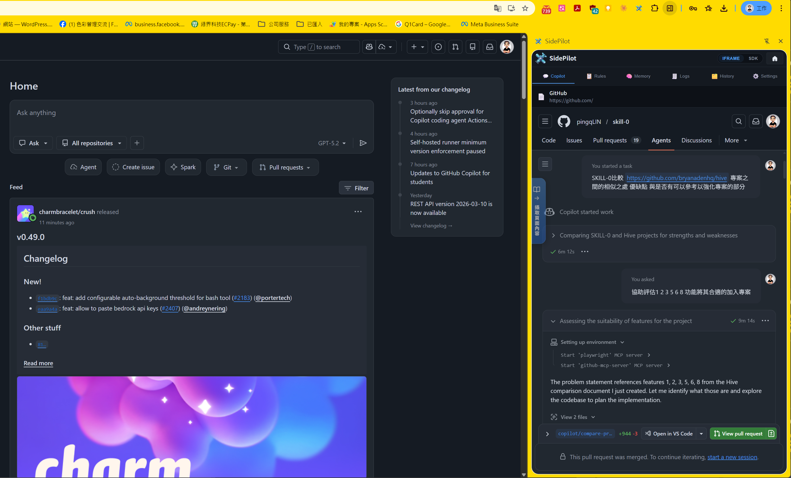
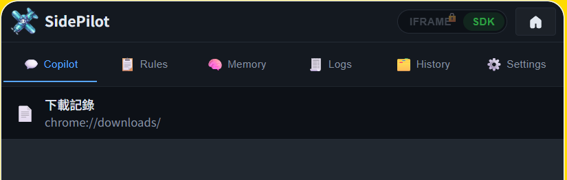
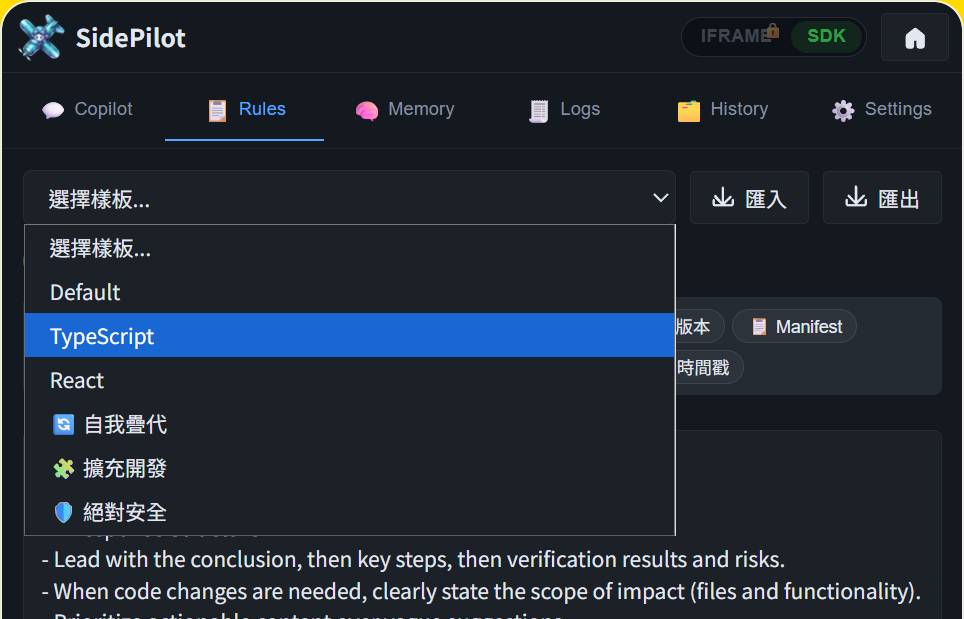
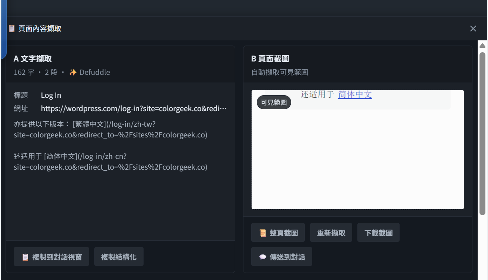
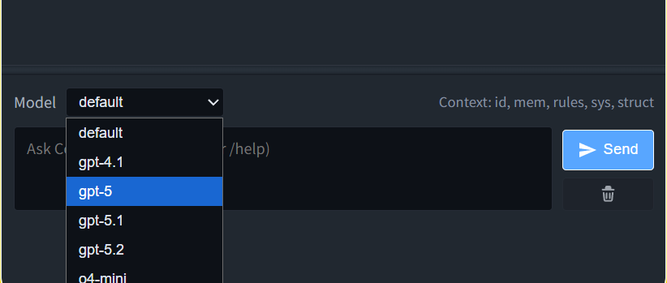
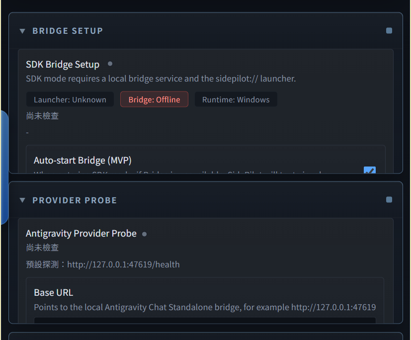
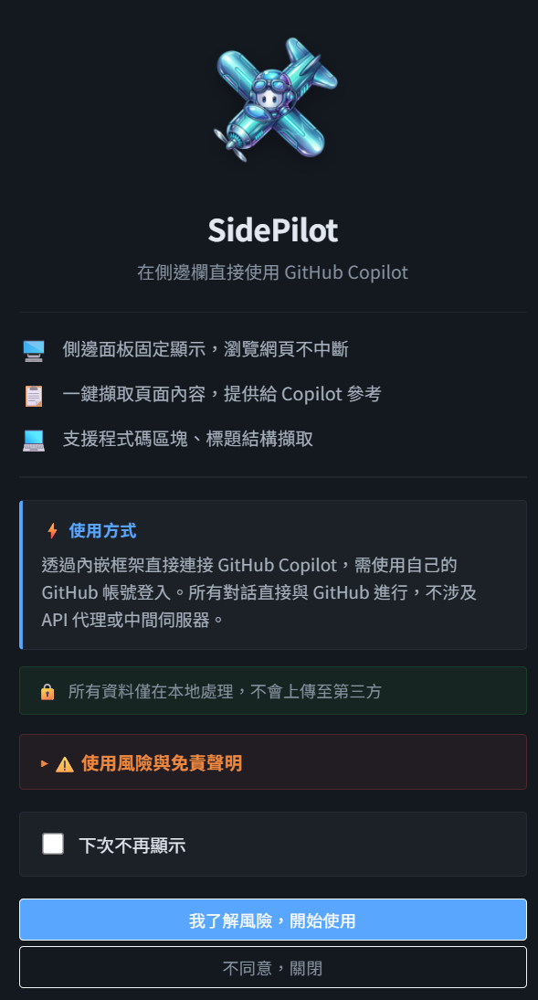

<p align="center">
  
</p>

<h1 align="center">SidePilot</h1>

<p align="center">
  
  
  
  
  
  
</p>

<p align="center">
  <b>A Chrome extension that keeps GitHub Copilot in your browser side panel — so you can chat, capture, and keep context without leaving the page.</b>
</p>

<p align="center">
  <a href="#-what-is-sidepilot">Overview</a> &bull;
  <a href="#-product-preview">Preview</a> &bull;
  <a href="#-core-features-at-a-glance">Features</a> &bull;
  <a href="#-quick-start">Quick Start</a> &bull;
  <a href="#-documentation-tabs">Docs</a> &bull;
  <a href="docs/guide/api/README.md">API</a> &bull;
  <a href="docs/SCREENSHOTS.md">Screenshots</a>
</p>

<p align="center">
  <a href="README.zh-TW.md">繁體中文</a> &bull;
  <a href="docs/guide/README.md">Guide Hub</a> &bull;
  <a href="docs/guide/getting-started/README.md">Getting Started</a> &bull;
  <a href="docs/guide/concepts/README.md">Concepts</a> &bull;
  <a href="docs/SCREENSHOTS.md">Screenshot Gallery</a>
</p>

---

<p align="center">
  
  <br>
  <sub>SidePilot keeps GitHub Copilot in the browser side panel — no tab switching needed.</sub>
</p>

---

## 🧭 What Is SidePilot?

SidePilot is a **Chrome Extension** (Manifest V3) that puts GitHub Copilot AI into the browser side panel. Its goal is simple: **let you work with AI where you're already working**.

Instead of bouncing between tabs, apps, and terminals, you can keep Copilot beside the page you're reading — docs, pull requests, dashboards, or bug reports — and bring that context into the conversation instantly.

### Why it exists

- **No tab switching** — AI stays next to the page you're working on
- **Two modes** — start instantly with iframe mode, or unlock full power with SDK mode
- **Context-aware workflow** — capture page text, code blocks, and screenshots directly from the browser
- **Persistent memory** — keep tasks, notes, and references across sessions
- **Rules-driven behavior** — shape responses with templates and custom instructions
- **Local-first setup** — bridge stays on `localhost`, no extra cloud relay

### Best for

- developers researching in the browser
- people who want persistent AI context
- users who want gradual setup from simple to advanced
- local-tooling power users on Windows / WSL

---

## 📸 Product Preview

<table>
  <tr>
    <td width="50%" align="center">
      <br>
      <b>Instant side-panel access</b><br>
      <sub>Open Copilot inside the browser side panel — switch IFRAME / SDK with one click.</sub>
    </td>
    <td width="50%" align="center">
      <br>
      <b>Rules that shape behavior</b><br>
      <sub>Use built-in templates (TypeScript, React, Safety…) or write custom instructions.</sub>
    </td>
  </tr>
  <tr>
    <td width="50%" align="center">
      <br>
      <b>Capture what you're seeing</b><br>
      <sub>Pull text, code blocks, and screenshots straight from the page.</sub>
    </td>
    <td width="50%" align="center">
      <br>
      <b>Streaming SDK chat</b><br>
      <sub>Switch to the local bridge for richer control, models, and streaming.</sub>
    </td>
  </tr>
  <tr>
    <td width="50%" align="center">
      <br>
      <b>Bridge auto-start</b><br>
      <sub>SidePilot detects and launches the local bridge automatically when SDK mode is entered.</sub>
    </td>
    <td width="50%" align="center">
      <br>
      <b>Guided onboarding</b><br>
      <sub>Move from quick start to advanced mode without leaving the panel.</sub>
    </td>
  </tr>
  <tr>
    <td colspan="2" align="center">
      <br>
      <b>Browser usage in action</b><br>
      <sub>Copilot stays beside the page you're already on — no tab switching needed.</sub>
    </td>
  </tr>
</table>

---

## 🎯 Core Features at a Glance

| Feature | What it gives you | Screenshot |
| --- | --- | --- |
| **Dual Mode** | iframe for zero-config use, SDK for streaming + advanced context | `pic/14-header-tabs.png`, `pic/15-sdk-model-select.png` |
| **Memory Bank** | reusable tasks, notes, references, and context injection | `pic/20-history-tab.png` |
| **Rules & Templates** | Markdown instructions with built-in templates | `pic/16-rules-templates.png` |
| **Page Capture** | grab page text, code blocks, and screenshots without leaving the tab | `pic/19-page-capture.png` |
| **Bridge Auto-Start** | easier SDK startup with local launcher flow | `pic/18-settings-bridge.png` |

> Want the full walkthrough? Open [docs/FEATURES.md](docs/FEATURES.md).

---

## 🚀 Quick Start

### Do I need the Bridge?

The **Bridge** is a small local server that lives inside this repo. You do **not** need it to try SidePilot.

| I want to… | Do I need the Bridge? |
| --- | --- |
| Try SidePilot right now | **No** — just install the extension and open it |
| Use streaming chat, Memory Bank, or Rules | **Yes** — start the Bridge from the repo first |

> **What the Bridge is, in one sentence:** It is not a separate product or download. It lives at `scripts/copilot-bridge/` inside this repo. Wherever you cloned this repo, that is where the Bridge is.

---

### Path A — Instant start (no Bridge needed)

**Simpler option — download the packaged extension**

If you only want to install SidePilot and do not want to clone the repo first, download `SidePilot-extension-v*.zip` from GitHub Releases.

1. Download and extract the packaged zip
2. Open `chrome://extensions/`
3. Enable **Developer mode**
4. Click **Load unpacked**
5. Select the extracted folder

> Maintainers can generate this package from the repo root with `npm run package:extension`.

**Step 1 — Clone and build**

```bash
git clone https://github.com/pingqLIN/SidePilot.git
cd SidePilot
npm install
npm run build:vendor
```

**Step 2 — Load into Chrome**

1. Open `chrome://extensions/`
2. Enable **Developer mode** (toggle, top-right)
3. Click **Load unpacked**
4. Select the `extension/` folder inside the repo

**Step 3 — Open the panel**

Click the SidePilot icon in the toolbar, or press `Alt + Shift + P`.

The panel opens in **iframe mode** — Copilot is immediately accessible. No Bridge, no terminal, no extra configuration.

---

### Path B — Full features (Bridge required)

After completing Path A, do this once:

**Step 1 — Install the Bridge Launcher** (Windows, run from the repo root)

```powershell
npm run bridge-launcher:install:win
```

This registers a background launcher so the extension can start the Bridge automatically when you switch modes.

**Step 2 — Switch to SDK mode**

Click the mode toggle in the side panel (top-right corner). The extension will:
1. Detect that the Bridge is not running
2. Automatically launch it via the launcher you just installed
3. Show a one-time login guide

**Step 3 — Sign in to GitHub**

Click **Open GitHub Login** in the guide dialog and sign in with your GitHub account. A [GitHub Copilot subscription](https://github.com/features/copilot) is required.

**Step 4 — Done**

After initial setup, the Bridge starts automatically every time you switch to SDK mode. No terminal needed for daily use.

> **If the Bridge doesn't start automatically**, go to **Settings → Bridge Setup → Copy Quick Setup**, paste the command into a terminal, and run it. Full details: [docs/guide/getting-started/README.md](docs/guide/getting-started/README.md)

---

## 🗂️ Documentation

| Document | Best for |
| --- | --- |
| [Getting Started](docs/guide/getting-started/README.md) | step-by-step setup, path examples, troubleshooting |
| [Usage Manual](docs/USAGE.md) | configuration, settings reference, API details |
| [Concepts](docs/guide/concepts/README.md) | mental model for modes, memory, rules, and the bridge |
| [Feature Guide](docs/FEATURES.md) | full feature tour |
| [API Reference](docs/guide/api/README.md) | bridge endpoints |
| [Screenshots](docs/SCREENSHOTS.md) | UI walkthrough |

## 🔎 Recommended reading path

1. Read this page for the product overview
2. Open [Getting Started](docs/guide/getting-started/README.md) — it answers the most common first-timer questions
3. Open [Concepts](docs/guide/concepts/README.md) for the product mental model
4. Open [Usage Manual](docs/USAGE.md) for settings and advanced configuration

---

## 🤝 Contributing

Contributions are welcome! Please see our [Contributing Guide](CONTRIBUTING.md) for details.

**Quick Start:**

1. Fork the repository
2. Create a feature branch: `git checkout -b feature/my-feature`
3. Make changes and test locally
4. Commit with clear messages
5. Open a Pull Request

---

## ⚠️ Legal Notice

**SDK mode** uses the official `@github/copilot-sdk` and requires a valid GitHub Copilot subscription. This is the recommended path for sustained use.

**iframe mode** embeds `github.com/copilot` by removing `X-Frame-Options` and `Content-Security-Policy` response headers via the Chrome `declarativeNetRequest` API. A Copilot subscription is still required — GitHub continues to serve all content and process all requests normally. However, bypassing security headers is a gray area under [GitHub's Terms of Service](https://docs.github.com/en/site-policy/github-terms/github-terms-of-service). GitHub retains the right to take action against accounts or tools that circumvent their technical safeguards, even if no direct revenue harm occurs. Use at your own risk.

---

## 📜 License

This project is licensed under the [MIT License](LICENSE).

---

## 📦 Third-Party Licenses

### Bundled in the extension (`extension/js/vendor-content-cleaner.js`)

| Library | Version | License | Author |
| --- | --- | --- | --- |
| [Defuddle](https://github.com/kepano/defuddle) | 0.8.x | MIT | Steph Ango |
| [Turndown](https://github.com/mixmark-io/turndown) | 7.2.x | MIT | Dom Christie |

### Bridge server runtime dependencies (`scripts/copilot-bridge`)

| Library | Version | License | Notes |
| --- | --- | --- | --- |
| [@github/copilot-sdk](https://www.npmjs.com/package/@github/copilot-sdk) | 0.1.x | MIT | Official GitHub Copilot SDK |
| [@agentclientprotocol/sdk](https://www.npmjs.com/package/@agentclientprotocol/sdk) | 0.14.x | MIT | Agent Client Protocol SDK |
| [Express](https://expressjs.com/) | 5.x | MIT | HTTP server framework |
| [cors](https://github.com/expressjs/cors) | 2.8.x | MIT | CORS middleware |
| [archiver](https://www.archiverjs.com/) | 7.x | MIT | ZIP archive creation |
| [node-schedule](https://github.com/node-schedule/node-schedule) | 2.1.x | MIT | Cron-style scheduler |

> All third-party libraries retain their original licenses. See each library's repository for full license text.

---

## 🤖 AI-Assisted Development

This project was developed with AI assistance.

**AI Models Used:**

- Claude (Anthropic) — Architecture design, code generation, documentation
- GPT-5 (OpenAI Codex) — Code generation, debugging
- Gemini (Google DeepMind) — Documentation, visual assets

> **Disclaimer:** While the author has made every effort to review and validate the AI-generated code, no guarantee can be made regarding its correctness, security, or fitness for any particular purpose. Use at your own risk.
