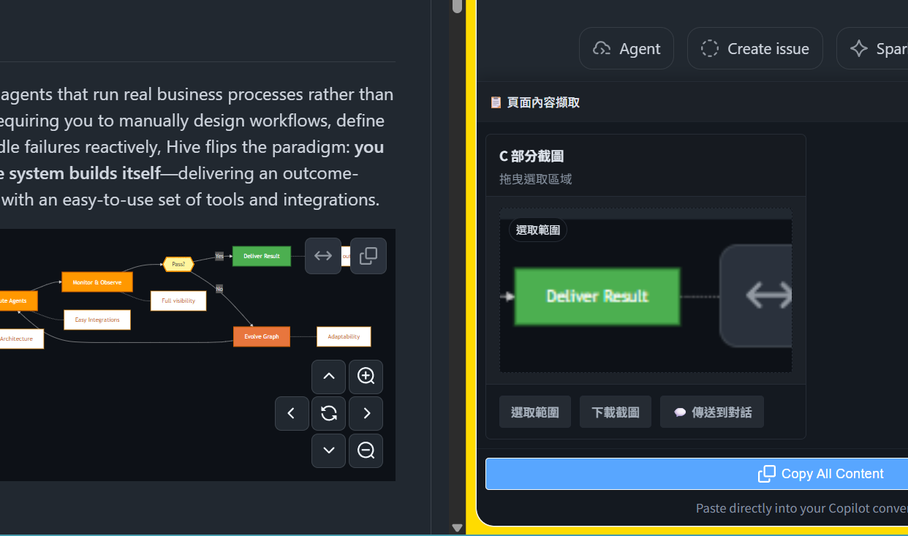
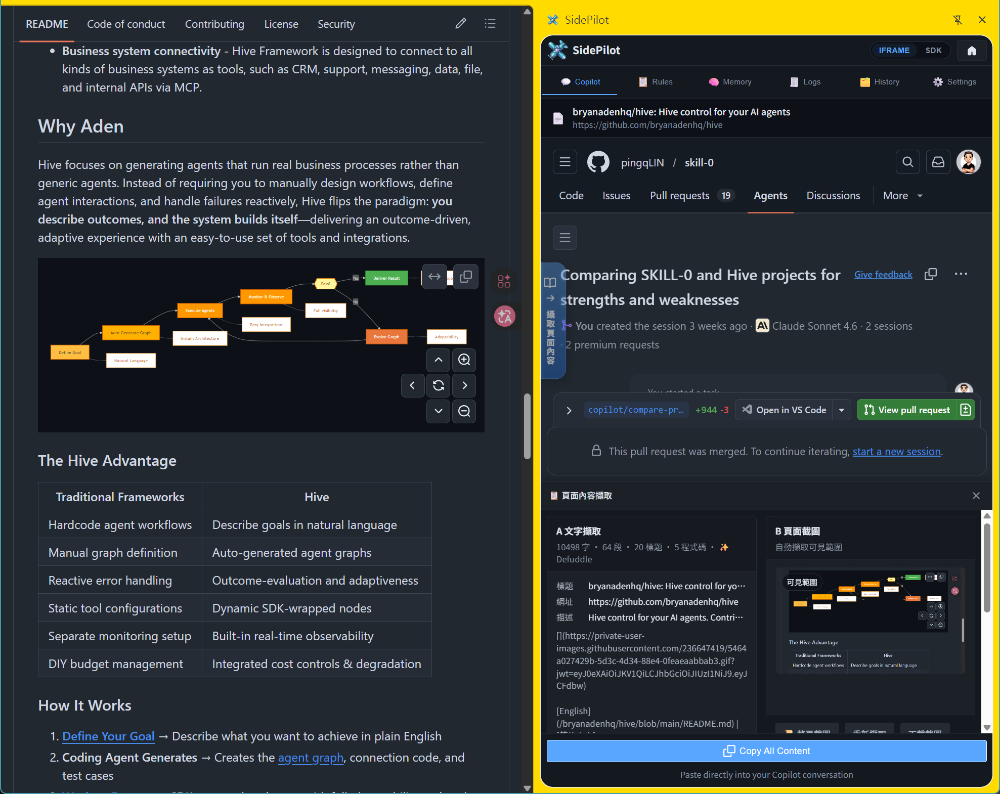
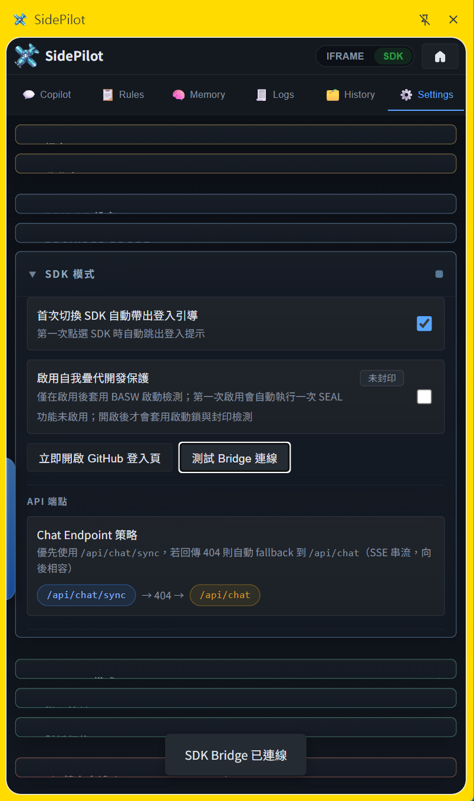

<p align="center">
  
</p>

<h1 align="center">SidePilot</h1>

<p align="center">
  
  
  
  
  
  
</p>

<p align="center">
  <b>一個把 GitHub Copilot 放進瀏覽器側邊欄的 Chrome 擴充功能 —— 讓你在原本的工作頁面旁邊，直接完成對話、擷取與上下文協作。</b>
</p>

<p align="center">
  <a href="#-sidepilot-是什麼">簡介</a> &bull;
  <a href="#-產品畫面預覽">預覽</a> &bull;
  <a href="#-核心功能一覽">功能</a> &bull;
  <a href="#-快速安裝">安裝</a> &bull;
  <a href="#-文件分頁">文件</a> &bull;
  <a href="docs/guide/api/README.zh-TW.md">API</a> &bull;
  <a href="docs/SCREENSHOTS.md">截圖</a>
</p>

<p align="center">
  <a href="README.md">English</a> &bull;
  <a href="docs/guide/README.zh-TW.md">文件導覽中心</a> &bull;
  <a href="docs/guide/getting-started/README.zh-TW.md">快速開始</a> &bull;
  <a href="docs/guide/concepts/README.zh-TW.md">核心觀念</a> &bull;
  <a href="docs/SCREENSHOTS.md">截圖導覽</a>
</p>

---

<p align="center">
  
  <br>
  <sub>SidePilot 在瀏覽器側邊欄直接與 GitHub Copilot 對話，無需切換分頁。</sub>
</p>

---

## 🧭 SidePilot 是什麼？

SidePilot 是一個 **Chrome 擴充功能**（Manifest V3），把 GitHub Copilot AI 助手放進瀏覽器的側邊面板。核心目標很簡單：**讓你在原本工作的地方就能跟 AI 協作。**

你在看文件、審 PR、查問題、逛後台頁面時，不需要一直切分頁或跳工具；SidePilot 會待在旁邊，並把目前頁面的內容更快帶進對話裡。

### 它解決什麼問題

- **不用切分頁** — AI 就在目前頁面旁邊
- **雙模式工作流** — 先用 iframe 模式快速上手，再升級到 SDK 模式
- **上下文擷取更直接** — 從瀏覽器直接抓文字、程式碼區塊、截圖
- **記憶可持續** — 任務、筆記、參考資料可以跨 Session 保存
- **規則可塑形** — 用樣板與規則約束 AI 行為
- **本機優先** — bridge 跑在 `localhost`，資料流更容易掌握

### 適合誰

- 在瀏覽器裡做研究與開發的人
- 需要持久上下文的重度 AI 使用者
- 想先零設定、之後再升級的人
- 使用 Windows / WSL 本機工具鏈的進階使用者

---

## 📸 產品畫面預覽

<table>
  <tr>
    <td width="50%" align="center">
      <br>
      <b>側邊欄立即可用</b><br>
      <sub>把 Copilot 放進瀏覽器側邊欄，一鍵切換 IFRAME / SDK 模式。</sub>
    </td>
    <td width="50%" align="center">
      <br>
      <b>規則可塑形</b><br>
      <sub>內建 TypeScript、React、安全等樣板，或自訂指令讓 AI 回應風格更一致。</sub>
    </td>
  </tr>
  <tr>
    <td width="50%" align="center">
      <br>
      <b>所見即所擷取</b><br>
      <sub>直接從網頁抓文字、程式碼區塊與截圖。</sub>
    </td>
    <td width="50%" align="center">
      <br>
      <b>截圖框選傳 AI</b><br>
      <sub>拖曳選取頁面任意區域，直接把截圖傳入 Copilot 對話。</sub>
    </td>
  </tr>
  <tr>
    <td width="50%" align="center">
      <br>
      <b>Bridge 自動啟動</b><br>
      <sub>進入 SDK 模式時自動偵測並啟動本地 bridge，不用手動拉起。</sub>
    </td>
    <td width="50%" align="center">
      <br>
      <b>在任何頁面直接協作</b><br>
      <sub>瀏覽 GitHub、看文件、審 PR — AI 就在旁邊，不需要切換分頁。</sub>
    </td>
  </tr>
  <tr>
    <td colspan="2" align="center">
      <br>
      <b>瀏覽器實際使用示意</b><br>
      <sub>在 GitHub 旁邊直接與 Copilot 對話 — AI 就待在你工作的頁面旁邊，不需要切換分頁。</sub>
    </td>
  </tr>
</table>

---

## 🎯 核心功能一覽

| 功能 | 你會得到什麼 | 對應截圖 |
| --- | --- | --- |
| **雙模式** | iframe 免設定、SDK 進階串流與上下文能力 | `pic/14-header-tabs.png`, `pic/15-sdk-model-select.png` |
| **記憶庫** | 任務、筆記、參考與上下文可重複利用 | `pic/20-history-tab.png` |
| **規則與樣板** | 用 Markdown 指令穩定 AI 回應風格 | `pic/16-rules-templates.png` |
| **頁面擷取** | 直接從瀏覽器抓文字、程式碼、截圖 | `pic/19-page-capture.png` |
| **Bridge 自動啟動** | SDK 模式更容易拉起本地 bridge | `pic/18-settings-bridge.png` |

> 想看完整巡覽，請打開 [docs/FEATURES.md](docs/FEATURES.md)。

---

## 🚀 快速安裝

### 需要 Bridge 嗎？

Bridge 是一個跑在本機的小型伺服器，放在這個 repo 裡。你**不需要它**就能先試用 SidePilot。

| 我想要… | 需要 Bridge 嗎？ |
| --- | --- |
| 先快速試用 SidePilot | **不需要** — 只裝 extension，打開就能用 |
| 使用串流對話、記憶庫或規則 | **需要** — 先從 repo 裡啟動 Bridge |

Bridge 不是獨立產品，也不需要另外下載。它就在 `scripts/copilot-bridge/`，clone repo 後就在那裡。

---

### 路線 A — 立即開始（不需要 Bridge）

到 GitHub Releases 下載 `SidePilot-extension-v*.zip`，解壓縮後：

1. 開啟 `chrome://extensions/`
2. 啟用 **開發人員模式**（右上角切換）
3. 點擊 **載入未封裝項目**，選取解壓後的資料夾

> 維護者可在 repo 根目錄執行 `npm run package:extension` 產生封裝包。

如需從原始碼建置，clone 後選取 repo 裡的 `extension/` 資料夾：

```bash
git clone https://github.com/pingqLIN/SidePilot.git
cd SidePilot
npm install
npm run build:vendor
```

點擊工具列的 SidePilot 圖示，或按 `Alt + Shift + P` 開啟側邊欄。側邊欄以 **iframe 模式** 啟動 — 不需要 Bridge、不需要終端機、不需要額外設定。

> **開發者注意：SEAL / 封印**
> `extension/` 底下的關鍵檔案（`manifest.json`、`background.js`、`sidepanel.js`、`sidepanel.html`、`styles.css`、rules templates）變更後，`manifest.version_name` 內的 SEAL digest 可能會失配。
> 預期中的開發變更：先確認 diff，再執行 `npm run integrity:seal`，最後用 `npm run basw:verify` 驗證。
> 非預期變更：請不要直接重跑 seal，先找出 drift 來源。

---

### 路線 B — 完整功能（需要 Bridge）

完成路線 A 之後，依序執行：

**1. 安裝 Bridge Launcher（Windows）**

在 repo 根目錄執行：

```powershell
npm run bridge-launcher:install:win
```

這會在系統層級註冊背景啟動器，讓 extension 切換模式時自動把 Bridge 拉起來。

**2. 切換到 SDK 模式**

點擊側邊欄右上角的模式切換按鈕，選擇 **SDK**。extension 會自動偵測並透過啟動器拉起 Bridge，並顯示一次性的登入引導對話框。

**3. 登入 GitHub**

在引導對話框中點擊 **Open GitHub Login**，以 GitHub 帳號登入。需要 [GitHub Copilot 訂閱](https://github.com/features/copilot)。

初次設定完成後，每次切到 SDK 模式都會自動啟動 Bridge，不需要再開終端機。

Bridge 的啟動、診斷與複製指令現在都集中在 **設定 → Bridge Setup**。先看 Quick Start；只有需要排障時再打開 Connection Details / Advanced。

<p align="center">
  
  <br>
  <sub>Settings → Bridge Setup — Quick Start 顯示「Bridge 已就緒」，Connection Details 也能看到目前 Bridge / CLI 狀態，代表設定成功。</sub>
</p>

> **如果 Bridge 沒有自動啟動**，請到 **設定 → Bridge Setup → Copy Quick Setup**，把指令貼到終端機執行。完整說明：[docs/guide/getting-started/README.zh-TW.md](docs/guide/getting-started/README.zh-TW.md)

---

## 🗂️ 文件

| 文件 | 適合用途 |
| --- | --- |
| [快速開始](docs/guide/getting-started/README.zh-TW.md) | 詳細步驟、路徑範例、常見問題排查 |
| [使用手冊](docs/USAGE.zh-TW.md) | 設定、設定參考、API 細節 |
| [核心觀念](docs/guide/concepts/README.zh-TW.md) | 模式、記憶庫、規則、Bridge 的心智模型 |
| [功能總覽](docs/FEATURES.md) | 完整功能巡覽 |
| [API 參考](docs/guide/api/README.zh-TW.md) | Bridge 端點 |
| [截圖導覽](docs/SCREENSHOTS.md) | UI 視覺展示 |

## 🔎 建議閱讀順序

1. 先看這份 README，理解產品定位
2. 打開[快速開始](docs/guide/getting-started/README.zh-TW.md) — 它回答了新手最常見的問題
3. 打開[核心觀念](docs/guide/concepts/README.zh-TW.md)建立心智模型
4. 打開[使用手冊](docs/USAGE.zh-TW.md)看設定與進階配置

---

## 🤝 貢獻

歡迎貢獻！詳見 [Contributing Guide](CONTRIBUTING.md)。

**快速開始：**

1. Fork 此倉庫
2. 建立 feature branch：`git checkout -b feature/my-feature`
3. 在本機修改並測試
4. 以清楚的訊息 commit
5. 開啟 Pull Request

---

## ⚠️ 法律聲明

> 本擴充嵌入 GitHub Copilot 網頁介面（iframe 模式）並使用官方 Copilot CLI SDK（SDK 模式）。使用風險自負，請確認遵守 [GitHub 服務條款](https://docs.github.com/en/site-policy/github-terms/github-terms-of-service)。

---

## 📜 授權

本專案採用 [MIT 授權條款](LICENSE)。

---

## 🤖 AI 輔助開發

本專案在 AI 輔助下開發。

**使用的 AI 模型：**

- Claude (Anthropic) — 架構設計、程式碼生成、文件撰寫
- GPT-5 (OpenAI Codex) — 程式碼生成、除錯
- Gemini (Google DeepMind) — 文件撰寫、視覺素材

> **免責聲明：** 作者已盡力審查驗證 AI 生成的程式碼，但無法保證其正確性、安全性或適用於特定用途。使用風險自負。
