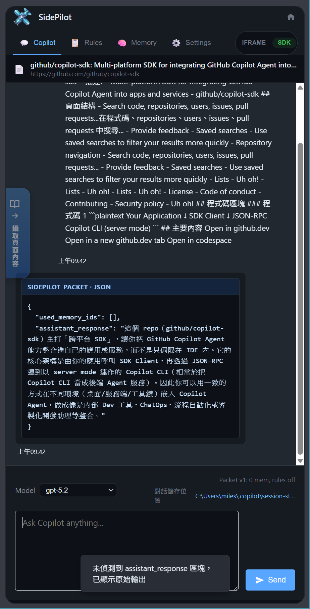

<p align="center">
  
</p>

<h1 align="center">SidePilot</h1>

<p align="center">
  
  
  
</p>

<p align="center"><b>SidePilot — GitHub Copilot for your Browser Side Panel</b></p>

<p align="center">
  <a href="#screenshots">截圖</a> •
  <a href="#features">功能特色</a> •
  <a href="#getting-started">快速開始</a> •
  <a href="#sdk-mode-setup">SDK 模式</a> •
  <a href="#configuration">設定</a>
</p>

[English](README.md)

---

## ✨ Screenshots

### iframe 模式


### SDK 模式



---

## ✨ Features

- **雙模式**：iframe 模式直接顯示 Copilot 網頁，SDK 模式連接 Copilot CLI bridge
- **規則與記憶**：管理行為規則與可重用記憶條目
- **頁面擷取**：直式擷取按鍵，可調整寬度
- **Sidecar 邊界**：iframe 連結支援白名單與黑名單
- **Config 同步**：可選擇同步 `~/.copilot/config.json`

---

## 🚀 Getting Started

### 安裝擴充功能

1. 開啟 `chrome://extensions/`
2. 啟用「開發人員模式」
3. 點擊「載入未封裝項目」
4. 選擇 `SidePilot/extension`

### 開啟側邊欄

- 點擊擴充功能圖示，或
- 按下 `Alt+Shift+P`（Windows/Linux）或 `Opt+Shift+P`（macOS）

---

## 🔧 SDK Mode Setup

SDK 模式會透過本機 bridge 連接 GitHub Copilot CLI。

### 需求

- Node.js 18+
- 已安裝並登入 GitHub Copilot CLI

### 啟動 Bridge

```powershell
cd scripts/copilot-bridge
npm install
npm run dev
```

啟動完成後，切換至 **SDK** 模式即可使用。

---

## ⚙️ Configuration

| 區域 | 主要設定 | 說明 |
| --- | --- | --- |
| iframe 模式 | 白名單 / 黑名單 | 控制哪些連結留在 iframe | 
| 擷取功能 | 按鍵寬度 | 調整直式擷取按鍵大小 | 
| SDK 模式 | Include Memory / Rules | 注入上下文後再送出 | 
| Copilot CLI | Config 同步 | 同步設定到 `~/.copilot/config.json` | 
| 儲存位置 | 路徑 | 對話匯出與截圖存檔路徑 | 

---

## 🧭 Troubleshooting

- **Bridge server not available**：啟動 `scripts/copilot-bridge` 並確認 `copilot --acp` 可用
- **HTTP 404 from SDK**：確認 bridge 服務已在 `31031` 埠口啟動

---

## ⚠️ Legal Notice

> 此擴充會嵌入 GitHub Copilot 網頁並使用 Copilot CLI SDK。使用前請確認符合 GitHub 服務條款，風險自負。

---

## 🤝 Contributing

歡迎貢獻，建議先開 Issue 討論需求。

---

## 📜 License

本專案採用 [MIT License](https://opensource.org/licenses/MIT)。

---

## 🤖 AI-Assisted Development

This project was developed with AI assistance.

**AI Models/Services Used:**

- OpenAI GPT-5 (Codex)

> ⚠️ **Disclaimer:** While the author has made every effort to review and validate the AI-generated code, no guarantee can be made regarding its correctness, security, or fitness for any particular purpose. Use at your own risk.
