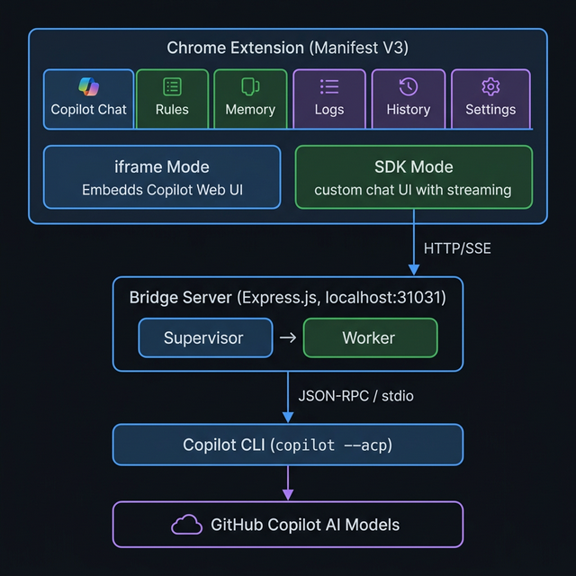
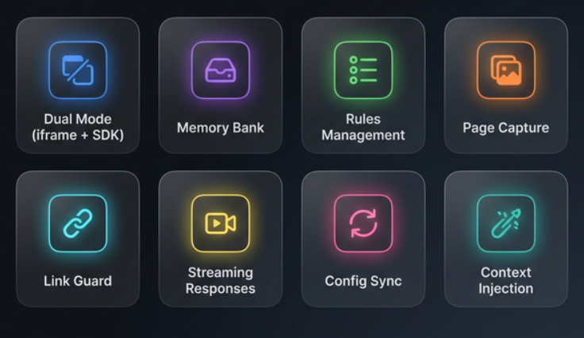
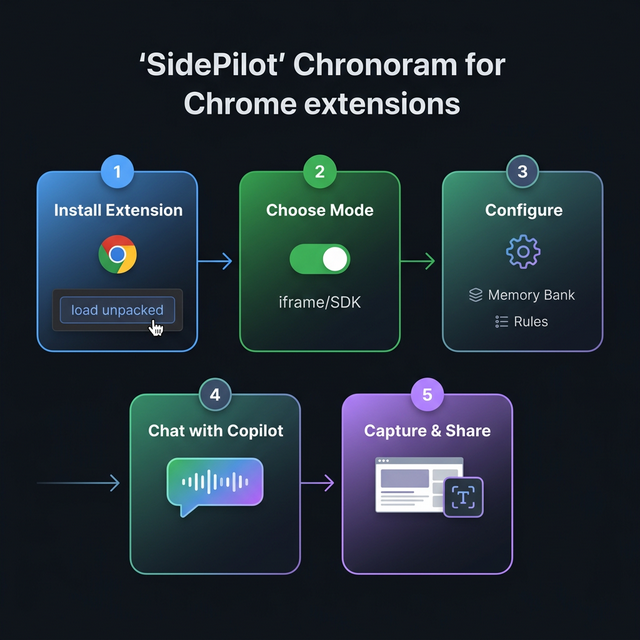

# SidePilot 截圖導覽

> 本文件提供 SidePilot 所有截圖的詳細導覽，說明每張圖片對應的功能區域與使用情境。

| 你會在這裡看到 | 適合用途 | 延伸閱讀 |
| --- | --- | --- |
| 精選功能截圖 + 最新原始 UI 補充截圖 | README 視覺素材、發佈導覽、文件引用 | [../README.zh-TW.md](../README.zh-TW.md), [../pic/INDEX.md](../pic/INDEX.md) |

---

## 最新版 UI 補充截圖（2026-03-13）

以下為你最新提供、尚未重新命名的原始擷圖。先正式收錄，方便後續 README / 文件挑圖與替換：

| 檔名 | 狀態 | 備註 |
| --- | --- | --- |
| `pic/螢幕擷取畫面 2026-03-13 145550.png` | 新增 | 最新版 UI 原始截圖 |
| `pic/螢幕擷取畫面 2026-03-13 145619.png` | 新增 | 最新版 UI 原始截圖 |
| `pic/螢幕擷取畫面 2026-03-13 145648.png` | 新增 | 最新版 UI 原始截圖 |
| `pic/螢幕擷取畫面 2026-03-13 145703.png` | 新增 | 最新版 UI 原始截圖 |
| `pic/螢幕擷取畫面 2026-03-13 145719.png` | 新增 | 最新版 UI 原始截圖 |
| `pic/螢幕擷取畫面 2026-03-13 145750.png` | 新增 | 最新版 UI 原始截圖 |

> 如果後續你想把這批圖正式升格成 README 主視覺，我建議下一步先重新命名成用途導向檔名，例如 `13-sdk-dashboard.png` 這類，文件會更穩定也更好維護。

---

## 1. iframe 模式主畫面

**檔案：** `pic/01-iframe-mode.png`

| 項目         | 說明                                                                |
| ------------ | ------------------------------------------------------------------- |
| **功能區域** | iframe 模式 — Copilot 分頁                                          |
| **展示內容** | GitHub Copilot 網頁介面嵌入在擴充側邊面板中                         |
| **使用情境** | 零設定即可使用的 Copilot 對話模式                                   |
| **關鍵元素** | 頂部模式切換按鈕（iframe/sdk）、嵌入的 Copilot 對話介面、Tab 導覽列 |

---

## 2. SDK 模式對話

**檔案：** `pic/02-sdk-chat.png`

| 項目         | 說明                                                                 |
| ------------ | -------------------------------------------------------------------- |
| **功能區域** | SDK 模式 — Copilot 分頁                                              |
| **展示內容** | 透過 Bridge Server 的即時串流對話介面                                |
| **使用情境** | 需要完整功能（記憶注入、規則系統）的開發工作                         |
| **關鍵元素** | 模型選擇下拉選單、串流回應顯示、Memory injection 狀態指示、Send 按鈕 |

---

## 3. Rules 管理介面

**檔案：** `pic/03-rules-tab.png`

| 項目         | 說明                                                                       |
| ------------ | -------------------------------------------------------------------------- |
| **功能區域** | Rules 分頁                                                                 |
| **展示內容** | 行為指令編輯器，含樣板選擇與工具列                                         |
| **使用情境** | 定義 AI 回應風格、編碼慣例等行為指令                                       |
| **關鍵元素** | 樣板下拉選單、匯入/匯出按鈕、來源標籤、模組標籤、Markdown 編輯器、儲存按鈕 |

---

## 4. Settings 面板

**檔案：** `pic/04-settings-panel.png`

| 項目         | 說明                                              |
| ------------ | ------------------------------------------------- |
| **功能區域** | Settings 分頁（總覽）                             |
| **展示內容** | 可折疊的設定區塊總覽                              |
| **使用情境** | 調整擴充的各項偏好設定                            |
| **關鍵元素** | 折疊式區塊標題、開關元件、Bridge 安裝助手步驟按鈕 |

---

## 5. SDK 設定

**檔案：** `pic/05-settings-sdk.png`

| 項目         | 說明                                                                                   |
| ------------ | -------------------------------------------------------------------------------------- |
| **功能區域** | Settings 分頁 — SDK 模式區塊                                                           |
| **展示內容** | Context Injection 開關、Prompt 策略、API 端點設定                                      |
| **使用情境** | 細調 SDK 對話的上下文注入與回應風格                                                    |
| **關鍵元素** | Identity/Memory/Rules/System Instructions 子開關、Endpoint 策略顯示、Prompt 策略按鈕組 |

---

## 6. 頁面擷取 — 文字內容

**檔案：** `pic/06-page-capture-text.png`

| 項目         | 說明                                                     |
| ------------ | -------------------------------------------------------- |
| **功能區域** | Page Capture — 文字模式                                  |
| **展示內容** | 萃取頁面文字內容並在擷取面板中預覽                       |
| **使用情境** | 將網頁文章或文件內容傳入 Copilot 分析                    |
| **關鍵元素** | 擷取面板標題、內容預覽區、「複製全部內容」按鈕、提示文字 |

---

## 7. 頁面擷取 — 截圖

**檔案：** `pic/07-page-capture-screenshot.png`

| 項目         | 說明                                      |
| ------------ | ----------------------------------------- |
| **功能區域** | Page Capture — 截圖模式                   |
| **展示內容** | 框選任意區域進行截圖                      |
| **使用情境** | 擷取 UI 元素或特定區域供 Copilot 視覺分析 |
| **關鍵元素** | 選取框、截圖預覽、擷取面板                |

---

## 8. SDK 上下文注入

**檔案：** `pic/08-sdk-context.png`

| 項目         | 說明                                  |
| ------------ | ------------------------------------- |
| **功能區域** | SDK 模式 — Context Injection          |
| **展示內容** | 擷取的頁面上下文自動注入 SDK 對話提示 |
| **使用情境** | 將頁面內容作為背景資訊附在對話中      |
| **關鍵元素** | 擷取的上下文內容、注入狀態、對話訊息  |

---

## 9. SDK 登入引導

**檔案：** `pic/09-sdk-initial.png`

| 項目         | 說明                                           |
| ------------ | ---------------------------------------------- |
| **功能區域** | SDK 模式 — 首次登入                            |
| **展示內容** | 首次切換至 SDK 模式時的 GitHub 認證引導        |
| **使用情境** | 引導新使用者完成 GitHub 認證設定               |
| **關鍵元素** | 登入引導對話框、「立即開啟 GitHub 登入頁」按鈕 |

---

## 10–12. 生成視覺素材

### 10. 系統架構圖

**檔案：** `pic/10-architecture-diagram.png`

| 項目     | 說明                                  |
| -------- | ------------------------------------- |
| **類型** | 生成的視覺素材                        |
| **用途** | README 架構說明段落                   |
| **內容** | Extension → Bridge → CLI 的完整資料流 |

### 11. 功能亮點概覽

**檔案：** `pic/11-feature-highlights.png`

| 項目     | 說明                     |
| -------- | ------------------------ |
| **類型** | 生成的視覺素材           |
| **用途** | README 功能亮點段落      |
| **內容** | 8 大核心功能的圖示與標籤 |

### 12. 使用流程示意圖

**檔案：** `pic/12-workflow-diagram.png`

| 項目     | 說明                                              |
| -------- | ------------------------------------------------- |
| **類型** | 生成的視覺素材                                    |
| **用途** | FEATURES.md 概覽段落                              |
| **內容** | 安裝 → 選擇模式 → 設定 → 對話 → 擷取 的使用者旅程 |
