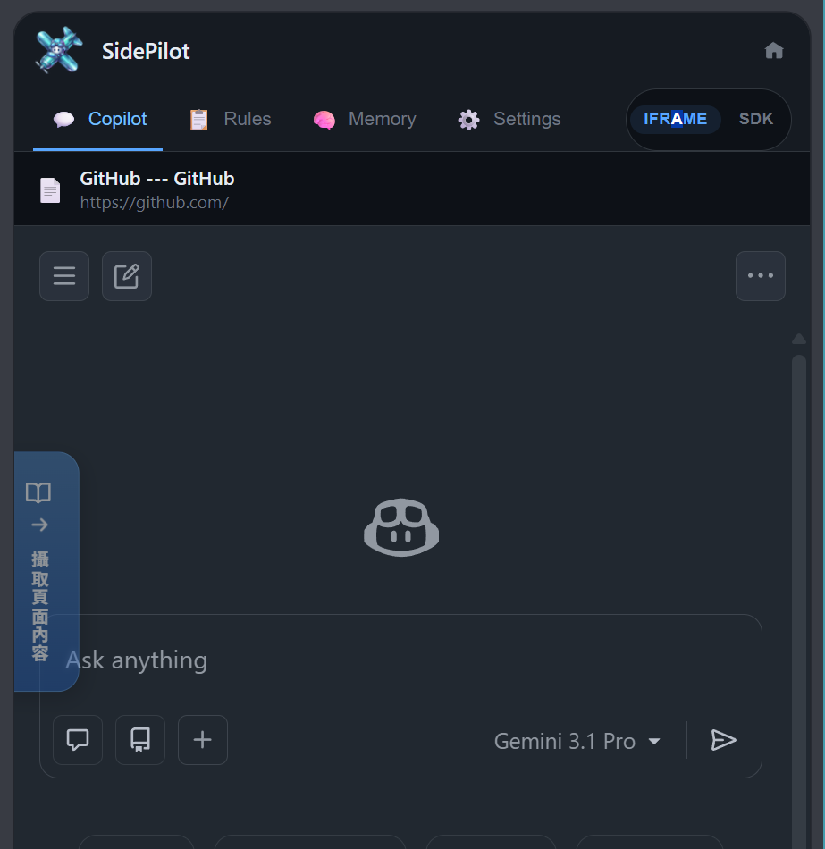
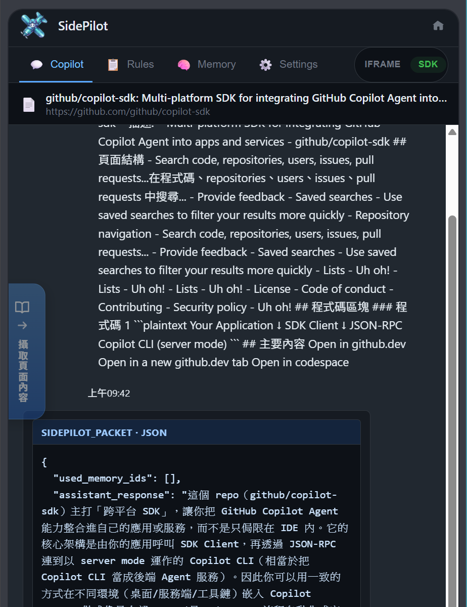
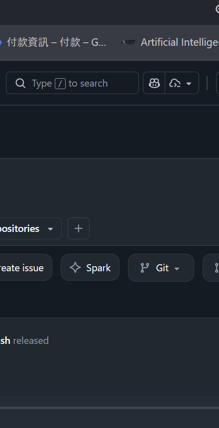
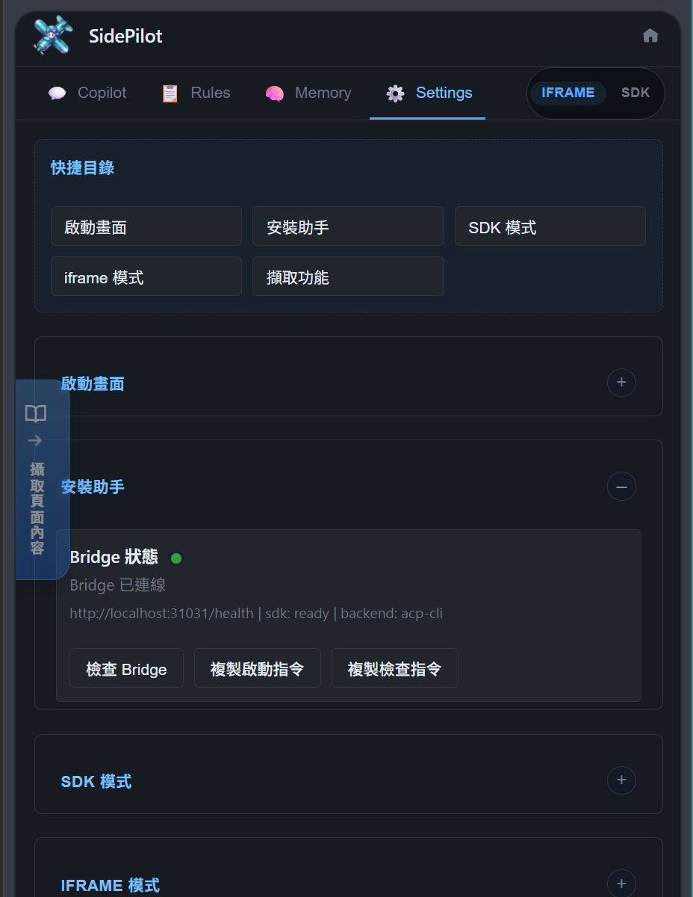
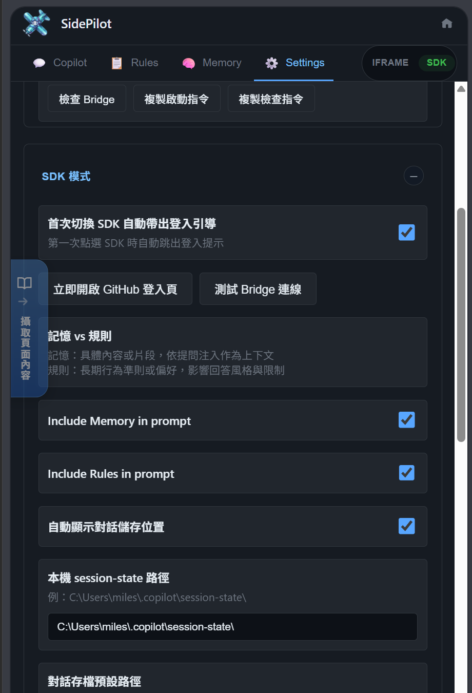
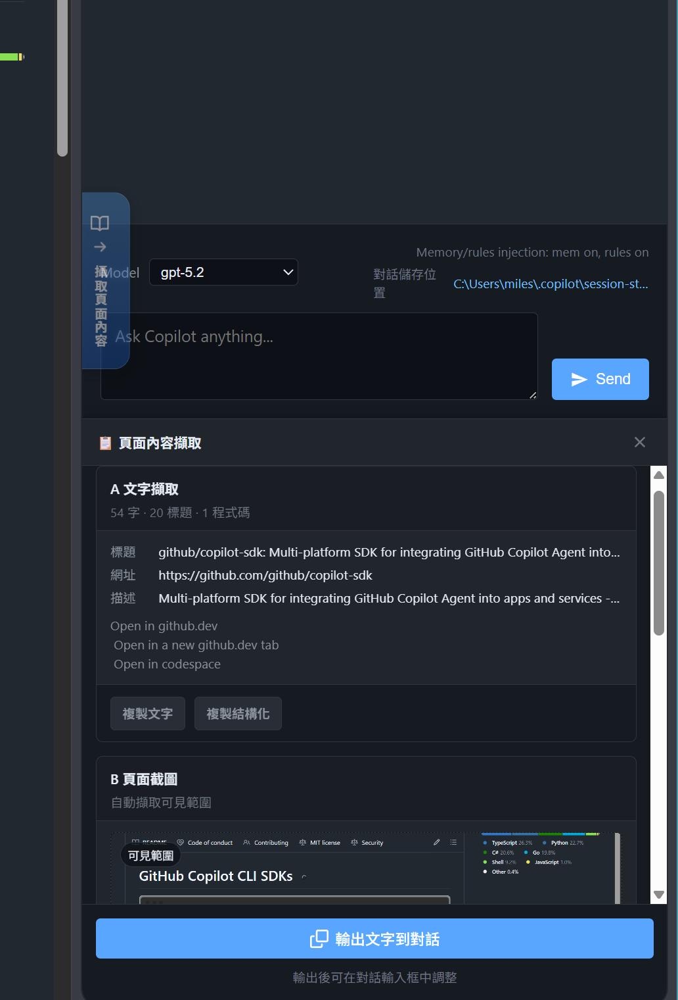
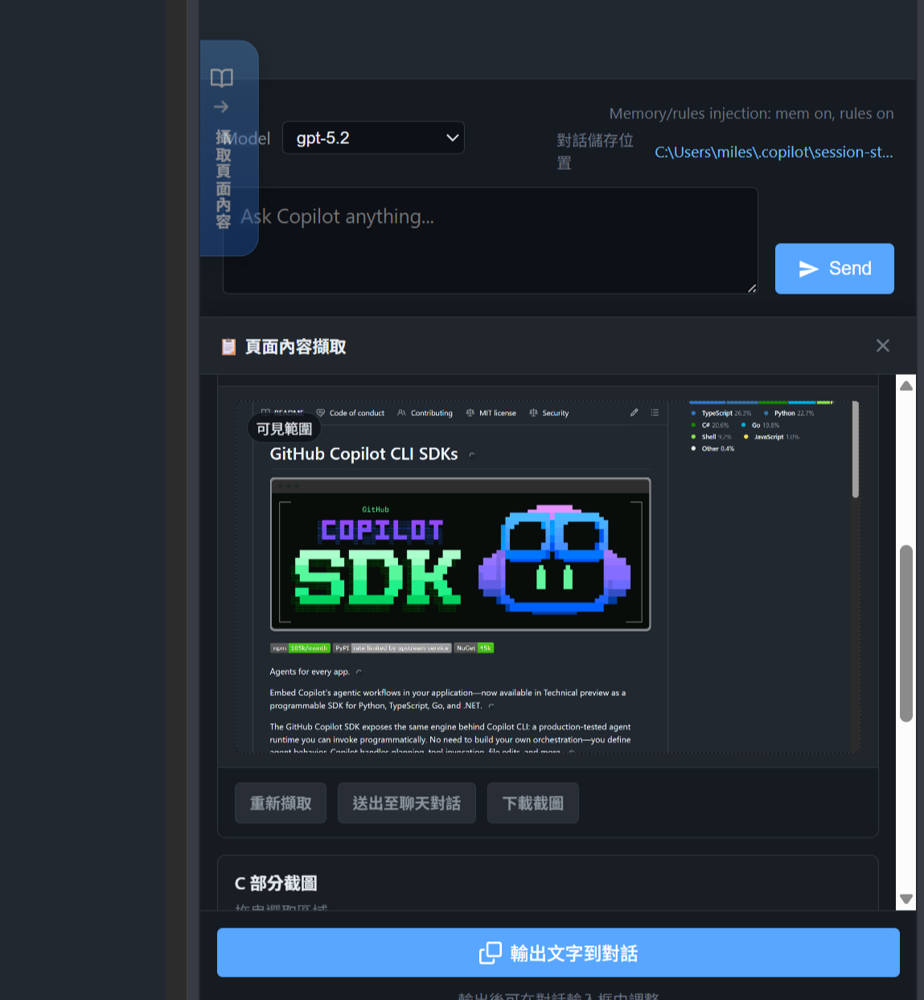
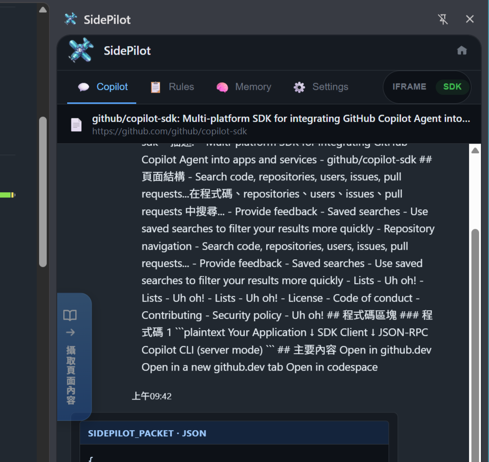
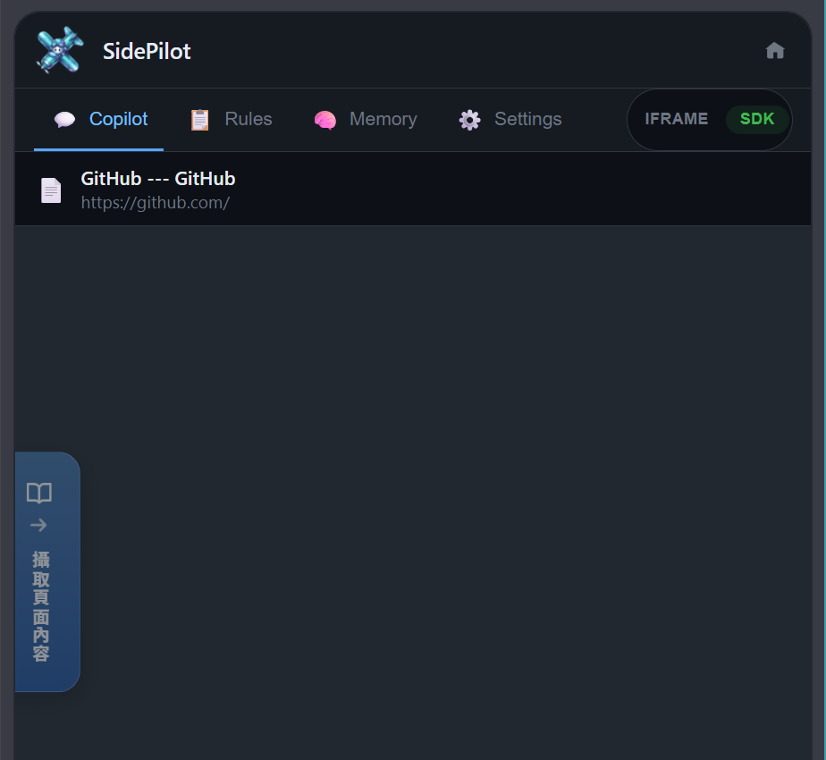

# SidePilot 截圖索引 / Screenshot Index

> 此資料夾收錄 SidePilot 擴充的所有截圖與視覺素材，供 README 與文件引用。

---

## 最新版 UI 原始擷圖（2026-03-13）

> 這批檔案是最新提供的 UI 截圖，檔名仍保留系統擷圖格式，先收錄以便挑圖與後續重命名。

| 檔名 | 狀態 | 建議用途 |
| --- | --- | --- |
| `raw-2026-03-13-145550.png` | 新增 | 候選 README / release screenshot |
| `raw-2026-03-13-145619.png` | 新增 | 候選 README / release screenshot |
| `raw-2026-03-13-145648.png` | 新增 | 候選 README / release screenshot |
| `raw-2026-03-13-145703.png` | 新增 | 候選 README / release screenshot |
| `raw-2026-03-13-145719.png` | 新增 | 候選 README / release screenshot |
| `raw-2026-03-13-145750.png` | 新增 | 候選 README / release screenshot |

## 批次匯入（來自根目錄整理）

> 從根目錄整理時移入，原始批次 webp 截圖，尚未命名分類。

| 檔名 | 狀態 | 建議用途 |
| --- | --- | --- |
| `raw-batch-001.webp` | 待分類 | 需確認內容後命名 |
| `raw-batch-002.webp` | 待分類 | 需確認內容後命名 |
| `raw-batch-003.webp` | 待分類 | 需確認內容後命名 |

---

## 最新版 UI 截圖（2026-03-14，已裁切）

> 從 `.bak/` 整理的最新 GUI 截圖，已裁切移除 Chrome 邊框，可直接用於 README。

| #   | 檔名                            | 功能區域             | 說明                                        |
| --- | ------------------------------- | -------------------- | ------------------------------------------- |
| 13  | `13-welcome-screen.png`         | 歡迎 / 首次啟動      | Onboarding 畫面：功能摘要、使用方式、免責聲明 |
| 14  | `14-header-tabs.png`            | 主 UI 頂列           | Logo + IFRAME/SDK 切換 + 6 個分頁標籤       |
| 15  | `15-sdk-model-select.png`       | SDK 模式 — 模型選擇  | 模型下拉選單（gpt-4.1、gpt-5、claude 等）    |
| 16  | `16-rules-templates.png`        | Rules 分頁           | 樣板選擇下拉（TypeScript、自我疊代、絕對安全等）|
| 17  | `17-settings-language.png`      | Settings — Language  | UI 語言選擇 + Display Scale 滑桿 + Startup 開關 |
| 18  | `18-settings-bridge.png`        | Settings — Bridge    | Bridge Setup 狀態列 + Auto-start + Provider Probe |
| 19  | `19-page-capture.png`           | Page Capture 面板    | A 文字擷取 + B 頁面截圖 雙欄面板              |
| 20  | `20-history-tab.png`            | History 分頁         | 對話歷史瀏覽（含 memory/context 標籤）        |
| 21  | `21-logs-tab.png`               | Logs 分頁            | 即時 INFO 日誌串流                            |

---

## 舊版截圖（Extension UI）

| #   | 檔名                                                                 | 功能區域          | 使用情境                                        | 引用文件         |
| --- | -------------------------------------------------------------------- | ----------------- | ----------------------------------------------- | ---------------- |
| 01  |  `01-iframe-mode.png`                         | iframe 模式       | 展示嵌入 GitHub Copilot Web UI 的主畫面         | README, FEATURES |
| 02  |  `02-sdk-chat.png`                               | SDK 模式          | 展示 SDK 模式的即時串流對話介面                 | README, FEATURES |
| 03  |  `03-rules-tab.png`                             | Rules 管理        | 展示規則編輯器、樣板選擇、匯入匯出              | README, FEATURES |
| 04  |  `04-settings-panel.png`                   | Settings 面板     | 展示可折疊的設定區塊總覽                        | README, FEATURES |
| 05  |  `05-settings-sdk.png`                       | SDK 設定          | 展示 SDK 模式的詳細設定（Context Injection 等） | README, FEATURES |
| 06  |  `06-page-capture-text.png`             | Page Capture      | 展示文字內容擷取功能與預覽                      | README, FEATURES |
| 07  |  `07-page-capture-screenshot.png` | Page Capture      | 展示部分截圖擷取功能                            | README, FEATURES |
| 08  |  `08-sdk-context.png`                         | Context Injection | 展示擷取的頁面上下文注入 SDK 對話               | README, FEATURES |
| 09  |  `09-sdk-initial.png`                         | SDK 登入引導      | 展示首次切換 SDK 模式的登入引導畫面             | README, FEATURES |

## 生成視覺素材

| #   | 檔名                          | 類型     | 說明                                             | 引用文件 |
| --- | ----------------------------- | -------- | ------------------------------------------------ | -------- |
| 10  | `10-architecture-diagram.png` | 架構圖   | 系統架構：Extension → Bridge → CLI 的資料流      | README   |
| 11  | `11-feature-highlights.png`   | 功能亮點 | 8 大核心功能圖示概覽                             | README   |
| 12  | `12-workflow-diagram.png`     | 工作流程 | 使用者旅程：安裝 → 選擇模式 → 設定 → 對話 → 擷取 | README   |
